<a id="mulu">目录</a>
<a href="#mulu" class="back">回到目录</a>
<style>
    .back{width:40px;height:40px;display:inline-block;line-height:20px;font-size:20px;background-color:lightyellow;position: fixed;bottom:50px;right:50px;z-index:999;border:2px solid pink;opacity:0.3;transition:all 0.3s;color:green;}
    .back:hover{color:red;opacity:1}
    img{vertical-align:bottom;}
</style>

<!-- @import "[TOC]" {cmd="toc" depthFrom=3 depthTo=6 orderedList=false} -->

<!-- code_chunk_output -->

- [NodeJS简介](#nodejs简介)
    - [基本使用](#基本使用)
    - [buffer](#buffer)
      - [创建](#创建)
      - [操作](#操作)
      - [补充说明](#补充说明)
    - [进程与线程](#进程与线程)
- [fs模块](#fs模块)
    - [文件写入](#文件写入)
    - [文件读取](#文件读取)
    - [文件移动和重命名](#文件移动和重命名)
    - [文件删除](#文件删除)
    - [文件夹操作](#文件夹操作)
    - [查看资源状态](#查看资源状态)
    - [文件路径说明](#文件路径说明)
    - [案例：批量重命名](#案例批量重命名)
- [path模块](#path模块)
- [http模块](#http模块)
    - [HTTP基本概念](#http基本概念)
      - [请求](#请求)

<!-- /code_chunk_output -->

<!-- 打开侧边预览：f1->Markdown Preview Enhanced: open...
只有打开侧边预览时保存才自动更新目录 -->

写在前面：此笔记来自b站课程[尚硅谷Node.js零基础视频教程](https://www.bilibili.com/video/BV1gM411W7ex) / [资料下载](https://pan.baidu.com/share/init?surl=sDOMvUdY9UF3mlJ7ujOADg&pwd=s3wj#list/path=%2F) 提取码：s3wj
### NodeJS简介
##### 基本使用
Node.js是一种JS运行环境，可以理解成是一个可以运行JS程序的软件
主要用于：构建服务器、开发工具类应用、桌面端应用
此课程使用的nodejs版本为18.12.1，[下载教程](https://blog.csdn.net/jiangjunyuan168/article/details/134216065)，建议先[更改下载地址为镜像网站](https://blog.csdn.net/qq_65142821/article/details/1387331817)

---

**简单使用**：
在vscode中按`ctrl`+``` ` ```键打开终端/右键文件后点击`在集成终端中打开`，输入`node JS文件名`即可使用node.js运行JS文件
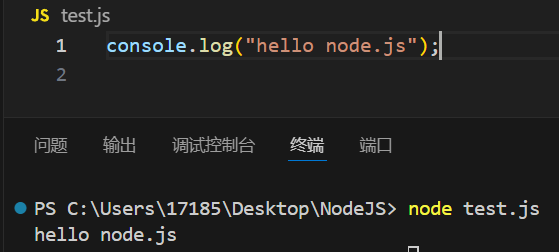{:width=200 height=200}
之后无特殊说明，代码都是在该文件种编写，并用这种方法运行

---

注意事项：**在Node.js中不能使用DOM和BOM的API**，如`window`、`document`、`navigator`等等
- 浏览器中的JS
    {:width=200 height=200}
- Node.js中的JS
    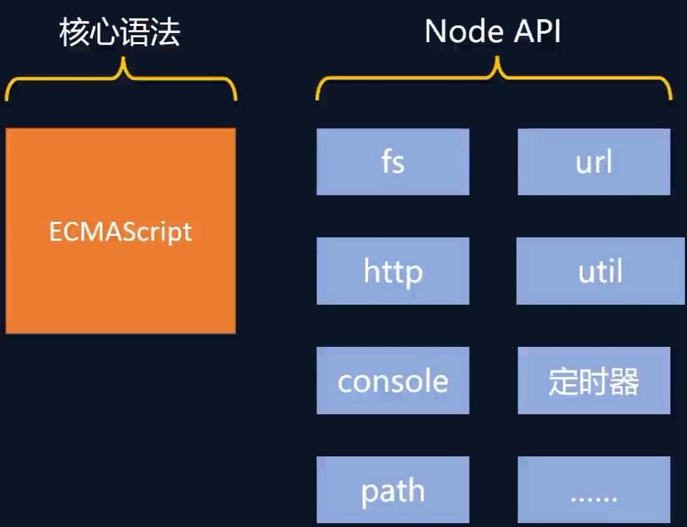{:width=200 height=200}

可以看到`console`和定时器是可以在Node.js中使用的

---

**Node.js中的顶级对象**：不是`window`，而是`global`和`globalThis`（它们指的是同一个对象）
##### buffer
**缓冲区**(buffer)：是一个类似于数组的对象，用于表示固定长度的字节序列
简单来说，buffer就是一段固定长度的内存空间，用于处理二进制数据
**特点**：
- 大小固定且无法更改
- 可以直接操作内存，因此性能较好
- 每个元素的大小为1字节(byte)，是一个8位二进制数

###### 创建
总共有3种方法
- `Buffer.alloc(大小)`
    ```js
    let buf = Buffer.alloc(10); //长度为10字节
    console.log(buf); 
    //<Buffer 00 00 00 00 00 00 00 00 00 00>
    ```
- `Buffer.allocUnsafe(大小)`
    ```js
    let buf = Buffer.allocUnsafe(10000);
    console.log(buf);
    //<Buffer f0 2c 05 c8 4e 02 00 00 ... 9950 more bytes>
    ```
    与上面`alloc`的区别：`allocUnsafe`使用的内存可能包含旧的内存数据。`alloc`会先对使用的内存进行清空归零，而`allocUnsafe`不会，因此结果中会有非零值，这就是旧的内存数据
    优点：速度比`alloc`更快
- `Buffer.from(字符串/数组)`将字符串或数组转换为buffer
    转换规则：每个字符/数组中元素都转为Unicode中的编码，该编码再转成二进制形式，存入buffer数组中
    ```js
    let buf = Buffer.from('hello');
    console.log(buf);
    //<Buffer 68 65 6c 6c 6f>
    let buf2 = Buffer.from([10, 101, 200, 119]);
    console.log(buf2);
    //<Buffer 0a 65 c8 77>
    ```
    为什么输出的是16进制：终端输出运行结果时，会对二进制数字进行转换，方便查看
###### 操作
- buffer与字符串的转换：`buf.toString()`
    ```js
    let buf = Buffer.from([105, 108, 111, 118, 101, 121, 111, 117]);
    console.log(buf.toString());
    //iloveyou
    ```
    注意：默认是utf-8编码
- 读写：可以直接使用`buf[index]`的方式获取/修改元素
    ```js
    let buf = Buffer.from([105, 108, 111, 118, 101, 121, 111, 117]);
    console.log(buf[0]); //105
    console.log(buf[0].toString(2)); //1101001
    buf[0] = 95; //修改
    console.log(buf); //<Buffer 5f 6c 6f 76 65 79 6f 75>
    console.log(buf.toString()); //_loveyou
    ```
    其中`buf[0].toString(2)`是将该元素转为2进制，终端输出时会自动省略前面的0，因此结果只有7位，实际结果应为`01101001`
###### 补充说明
- **溢出**：因为buffer的每个元素是8位2进制，最大只能保存255。如果将元素修改为>255的数，则会将高位数字舍弃
    ```js
    let buf = Buffer.from('hello');
    buf[0] = 361; //二进制为0001 0110 1001
    console.log(buf[0]); //105 只保留0110 1001
    console.log(buf); //<Buffer 69 65 6c 6c 6f>
    ```
- **中文**：也使用utf-8编码，一个汉字占3字节
    ```js
    let buf = Buffer.from('你好');
    console.log(buf); //<Buffer e4 bd a0 e5 a5 bd>
    ```
##### 进程与线程
**进程**：程序的一次执行过程，可以理解为正在执行的程序
**线程**：一个进程中执行的一个执行流，一个线程是属于某个进程的，一个进程至少包含一个线程
查看某个进程中的线程：下载pslist.exe，cmd中输入`pslist -dmx 进程PID`，进程PID在任务管理器的详细信息中
### fs模块
即file system，可以实现与内存/硬盘的交互，如文件/文件夹的创建删除、文件内容的读写等
**在使用任何模块前都需要进行导入**：
```js
const 变量名 = require('模块名');
//例如：
const fs = require('fs');
```
其中`const`也可以是`var`/`let`，`require`是导入模块的函数，变量名可以任取（一般与模块名相同），之后调用模块中的函数都用这个变量名
##### 文件写入
- **覆盖写入（同步/异步）**`fs.writeFile(file, data[, options], callback)`/`fs.writeFileSync(file, data[, options])`
- **追加写入（同步/异步）**`fs.appendFile(file, data[, options], callback)`/`fs.appendFileSync(file, data[, options])`
  - `file`文件名，如果不存在则自动创建
  - `data`要写入的数据
  - `callback`回调函数。接收1个参数`err`（变量名可任取），当写入失败时，`err`为错误对象；成功时`err`为null
  - `options`其它选项
  - 无返回值
- **流式写入**：
    ```js
    const ws = fs.createWriteStream(file);
    ws.write(data);
    ws.close();
    ```

例：
```js
const fs = require('fs');
fs.writeFile('./test.txt', 'hello node.js', err => {
    if (err) {
        console.log('写入失败');
        return;
    }
    console.log('写入成功');
});
```
该段程序将`'hello node.js'`覆盖写入`test.txt`中
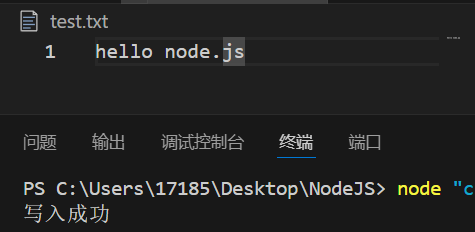{:width=150 height=150}

---

**异步写入**：有两个线程。**JS主线程**自上而下运行代码，遇到`writeFile`函数时，将写入操作交给**I/O线程**，此时JS主线程继续向下执行，不会等待I/O线程完成写入操作；当I/O线程完成写入操作后，它将回调函数放入JS主线程的任务队列中，根据JS主线程的事件循环机制来执行回调函数（即等待js文件中的其它代码执行后，再执行回调函数）
一个例子：
```js
const fs = require('fs');
fs.writeFile('./test.txt', 'hello node.js', err => {
    if (err) {
        console.log('写入失败');
        return;
    }
    console.log('写入成功');
});
console.log('123');
```
会先输出`123`再输出`写入成功`
**同步写入**：当JS主线程执行到该函数时，会等待I/O线程执行完毕后再往下执行。同步比异步的性能差

---

**追加写入**：不仅可以用`appendFile`系列函数，还可以用`writeFile`系列函数
方法：设置`option`参数的`flag`为`'a'`（追加写入append），该属性默认为`'w'`（覆盖写入write）
```js
const fs = require('fs');
fs.writeFile('./test.txt', '原有内容', err => {
    if (err) {
        console.log('写入失败');
        return;
    }
    console.log('写入成功');
});
fs.writeFile('./test.txt', '\n追加内容1', { flag: 'a' }, err => {
    if (err) {
        console.log('写入失败');
        return;
    }
    console.log('写入成功');
});
fs.appendFile('./test.txt', '\n追加内容2', err => {
    if (err) {
        console.log('写入失败');
        return;
    }
    console.log('写入成功');
});
```
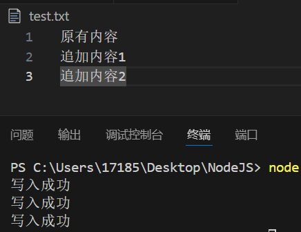{:width=200 height=200}

---

**流式写入**：先创建写入流对象（可以理解成一个通道/链接），再使用write函数追加写入，最后关闭通道。与python里面的文件写入类似
```js
const fs = require('fs');
const ws = fs.createWriteStream('./test.txt'); //创建写入流对象
ws.write('追加内容1\n');
ws.write('追加内容2\n');
ws.write('追加内容3\n'); //追加写入
ws.close(); //关闭通道（可省略）
```
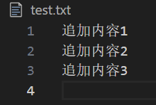{:width=100 height=100}
流式写入可以减少打开/关闭文件的次数，适用于大文件写入/频繁写入，而前面的方法适用于频率较低的写入

---

**文件写入的应用场景**：下载文件、安装软件、保存程序日志（比如git）、文本编辑器保存、视频录制等等
注意：当需要**持久化保存数据**时，应使用文件写入
##### 文件读取
- **异步读取**`fs.readFile(file[, option], callback)`，无返回值
  - `file`文件名，如果不存在则自动创建
  - `callback`回调函数，接收2个参数，分别为`err`和`data`
    - `err`与[文件写入](#文件写入)中的相同
    - `data`为文件内容，是buffer的形式
  - `options`其它选项
- **同步读取**`fs.readFileSync(file[, option])`，直接返回读取的数据，也是buffer的形式
- **流式读取**：可以理解成将文件分成多块读取，每一块的最大大小为65536字节(64KB)，适用于大文件的读取
    ```js
    const rs = fs.createReadStream(file); //创建读取流对象
    rs.on('data', chunk => { }); //绑定data事件
    rs.on('end', () => { }); //绑定end事件
    ```
    - data事件：每读取一块文件时触发，读取到的数据存入`chunk`中
    - end事件（可选）：当整个文件读取完成后触发

例：
```js
//异步读取
const fs = require('fs');
fs.readFile('./test.txt', (err, data) => {
    if (err) {
        console.log("读取失败");
        return;
    }
    console.log(data);
    console.log(data.toString());
});
```
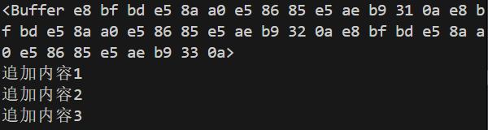{:width=100 height=100}
```js
//同步读取
const fs = require('fs');
let data = fs.readFileSync('./test.txt');
console.log(data.toString());
```
{:width=50 height=50}
```js
//流式读取
const fs = require('fs');
const rs = fs.createReadStream("./data/test.jpg");
rs.on('data', chunk => {
    console.log(chunk);
    console.log(chunk.length);
});
rs.on('end', () => {
    console.log("读取完毕");
});
```
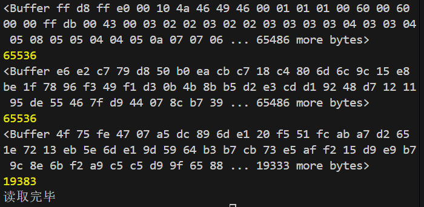{:width=250 height=250}
注：使用的文件大小为146KB

---

**文件读取的应用场景**：程序运行、打开/查看文件、上传文件、git查看日志等等

---

**例：文件复制**，即先读取文件，再写入
```js
const fs = require('fs');
//方式1：同步读写
const data = fs.readFileSync('./test.txt'); //读取文件内容
fs.writeFileSync('./test_copy.txt', data); //写入文件
//方式2：异步读写
fs.readFile('./test.txt', (err, data) => {
    if (err) {
        console.log("读取失败");
        return;
    }
    fs.writeFile('./test_copy.txt', data, err => {
        if (err) {
            console.log('写入失败');
            return;
        }
    });
});
//方式3：流式读写
const rs = fs.createReadStream('./test.txt'); //读取流对象
const ws = fs.createWriteStream('./test_copy.txt'); //写入流对象
rs.on('data', chunk => {
    ws.write(chunk); //每读取一块就写入一块
});
//方式4：流式读写，使用pipe函数，效果更好
rs.pipe(ws); //pipe：将rs的数据输入ws中
```
对于同步/异步读取，是先把文件的所有内容获取，存入内存中，再进行写入，因此读取大文件需要消耗大量的内存空间；而对于流式读写，每次只读取64KB的内容并写入，因此理想状态下只需要64KB的内存空间就可以完成（实际情况下由于读取速度更快，会有一些内容堆积在内存中等待写入，但仍比同步/异步读取占用内存小）
使用`process`模块来查看内存占用：
- 同步读写
    ```js
    const fs = require('fs');
    const process = require('process');
    const data = fs.readFileSync('./test.png');
    fs.writeFileSync('./test_copy1.png', data);
    console.log(process.memoryUsage());
    //rss: 29728768
    ```
- 异步读写
    ```js
    const fs = require('fs');
    const process = require('process');
    fs.readFile('./test.png', (err, data) => {
        if (err) {
            console.log("读取失败");
            return;
        }
        fs.writeFile('./test_copy2.png', data, err => {
            if (err) {
                console.log('写入失败');
                return;
            }
            console.log(process.memoryUsage());
        });
    });
    //rss: 29859840
    ```
- 流式读写
    ```js
    const fs = require('fs');
    const process = require('process');
    const rs = fs.createReadStream('./test.png');
    const ws = fs.createWriteStream('./test_copy3.png');
    rs.pipe(ws);
    console.log(process.memoryUsage());
    //rss: 28454912
    ```

由于这里使用的文件大小仅为1MB左右，内存节省不明显。如果想要看到明显效果，至少要10MB数量级
##### 文件移动和重命名
`fs.rename(文件原路径, 文件新路径, callback)`异步/`fs.renameSync(文件原路径, 文件新路径)`同步
- 移动和重命名都是依靠修改文件路径实现
- 回调函数接收一个参数`err`

例：
```js
const fs = require('fs');
//重命名，即新旧路径只有文件的名称不同
fs.rename('./test.txt', './new_test.txt', err => {
    if (err) {
        console.log('重命名失败');
        return;
    }
    console.log('重命名成功');
});
//移动，即新旧路径不同
setTimeout(() => { //重命名结束后再移动
    fs.rename('./new_test.txt', './test/new_test.txt', err => {
        if (err) {
            console.log('移动失败');
            return;
        }
        console.log('移动成功');
    });
    setTimeout(() => { //移动结束后再操作
        //移动
        fs.renameSync('./test/new_test.txt', './new_test.txt');
        //重命名
        fs.renameSync('./new_test.txt', './test.txt');
    }, 0);
}, 0);
```
在上面的代码中，我们将`'./test.txt'`重命名为`'./new_test.txt'`，之后移动到`'./test'`文件夹中，最后又将这一过程复原
注：移动到的新文件夹必须是已存在的
##### 文件删除
- `fs.unlink(文件路径, callback)`异步/`fs.unlinkSync(文件路径)`同步
- `fs.rm(文件路径, callback)`异步/`fs.rmSync(文件路径)`同步

例：
```js
const fs = require('fs');
fs.rm('./test.txt', err => {
    if (err) {
        console.log('删除失败');
        return;
    }
    console.log("删除成功");
});
fs.unlinkSync('./test1.txt');
```
##### 文件夹操作
- **创建**文件夹（异步/同步）`fs.mkdir(文件夹路径[, options], callback)`/`fs.mkdirSync(文件夹路径[, options])`
  - 回调函数接收一个参数`err`
  - **递归创建**（即创建一个a文件夹，在其中再创建一个b文件夹）：设置option属性`recursive: true`
- **删除**文件夹（异步/同步）
  - `fs.rmdir(文件夹路径[, options], callback)`/`fs.rmdirSync(文件夹路径[, options])`
  - `fs.rm(文件夹路径[, options], callback)`/`fs.rmSync(文件夹路径[, options])`（建议使用）
  - 回调函数接收一个参数`err`
  - 需要文件夹为空才能删除
  - **递归删除**（即文件夹内还有文件/文件夹）：还是设置option属性`recursive: true`
- **读取**文件夹（异步/同步）`fs.readdir(文件夹路径[, options], callback)`/`fs.readdirSync(文件夹路径[, options])`
  - 回调函数接收2个参数`err`和`data`，后者以数组形式列出文件夹中的内容（文件夹和文件的名称）
  - 对于同步读取，它将读取结果直接返回

例：
- **创建**
    ```js
    const fs = require('fs');
    fs.mkdir('./html', err => {
        if (err) {
            console.log('创建失败');
            return;
        }
        console.log('创建成功');
    });
    //递归创建
    fs.mkdirSync('./a/b', { recursive: true });
    ```
- **读取**
    ```js
    const fs = require('fs');
    fs.readdir('./', (err, data) => {
        if (err) {
            console.log('读取失败');
            return;
        }
        console.log('./', data);
    });
    console.log('../', fs.readdirSync('../'));
    ```
    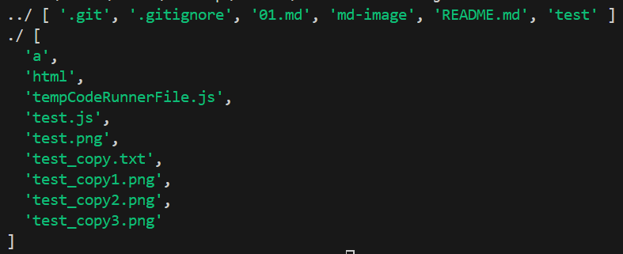{:width=200 height=200}
- **删除**
    ```js
    const fs = require('fs');
    fs.rmdirSync('./html');
    //递归删除
    fs.rmdir('./a', { recursive: true }, err => {
        if (err) {
            console.log('删除失败');
            return;
        }
        console.log('删除成功');
    });
    //递归删除
    fs.rm('./a', { recursive: true }, err => {
        if (err) {
            console.log('删除失败');
            return;
        }
        console.log('删除成功');
    });
    ```
##### 查看资源状态
`fs.stat(文件路径, callback)`/`fs.statSync(文件夹路径[, options])`
- 回调函数接收2个参数`err`和`data`，后者以类似于对象的形式列出文件信息
- 对于同步读取，它将读取结果直接返回

例：
```js
const fs = require('fs');
fs.stat('./test.png', (err, data) => {
    if (err) {
        console.log('操作失败');
        return;
    }
    console.log(data);
});
console.log(fs.statSync('./test.png'));
```
```
Stats {
  dev: 915514105,
  mode: 33206,
  nlink: 1,
  uid: 0,
  gid: 0,
  rdev: 0,
  blksize: 4096,
  ino: 23925373020643384,
  size: 1317887,
  blocks: 2576,
  atimeMs: 1724769221738.6213,
  mtimeMs: 1718964433265.3577,
  ctimeMs: 1724768416407.0315,
  birthtimeMs: 1724768412410.15,
  atime: 2024-08-27T14:33:41.739Z,
  mtime: 2024-06-21T10:07:13.265Z,
  ctime: 2024-08-27T14:20:16.407Z,
  birthtime: 2024-08-27T14:20:12.410Z
}
```
- `size`：文件大小
- `birthtime`：文件创建时间
- `atime`/`mtime`/`ctime`：最后一次访问/修改文件内容/修改文件状态的时间
  - 当文件内容更改时，mtime才会更新
  - 更改文件任何属性（包括内容），ctime都会更新

`data.isFile()`/`data.isDirectory()`判断该文件是不是文件/文件夹
```js
const fs = require('fs');
fs.stat('./test.png', (err, data) => {
    if (err) {
        console.log('操作失败');
        return;
    }
    console.log(data.isDirectory()); //false
    console.log(data.isFile()); //true
});
```
##### 文件路径说明
相对路径：
- `./xxx`等效于`xxx`
- `../xxx`是上一级的文件

绝对路径：
- `D:/xxx`
- `/xxx`常见于Linux，但Windows中也可以使用，它表示在当前工作路径的根目录下使用xxx文件
  - 例如当前工作路径是`C:/a/b`，`/xxx`指的就是`C:/xxx`；当前工作路径是`D:/a/b`，`/xxx`指的就是`D:/xxx`

一个小问题：现想要在`test.js`的目录下创建一个新文件`test.txt`，正常情况下应使用：
```js
fs.writeFileSync('./test.txt', '111');
```
之后在`test.js`的目录下执行
```
C:\Users\17185\Desktop\NodeJS\test> node test.js
```
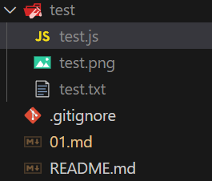{:width=150 height=150}
如果我们在`test.js`的上一级目运行test.js：
```
C:\Users\17185\Desktop\NodeJS> node test/test.js
```
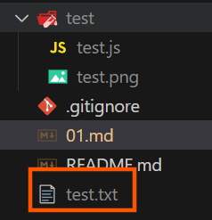{:width=150 height=150}
发现文件被创建在了上一级目录中
这是因为**fs中相对路径参照的是运行该文件的命令行的工作目录**，而不是该文件所在目录

---

解决办法：使用绝对路径`__dirname`，它可以简单理解为一个“全局变量”，值为**所在js文件的所在目录的绝对路径**
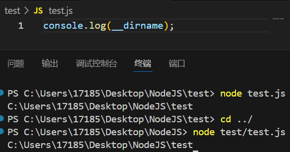{:width=200 height=200}
将`__dirname`与相对路径进行拼接，就可以解决上面的问题：
```js
const fs = require('fs');
fs.writeFileSync(__dirname + '/test.txt', '333');
```
此时无论在哪里运行该js文件，始终是在它同级目录下创建新文件

---

补充：`__filename`类似于`__dirname`，它保存**文件的绝对路径**
```js
console.log(__filename);
//C:\Users\17185\Desktop\NodeJS\test\test.js
```
##### 案例：批量重命名
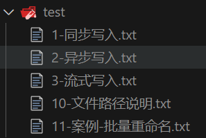{:width=150 height=150}
可以看到文件排序是按`1、2、3、10、11`的顺序，但在其它软件中，显示方式可能是`1、10、11、2、3`
为解决这一问题，可以在`1、2、3`这些个位数的前面加一个0，变成`01、02、03`
思路：
- 先得到所有文件名
- 遍历该数组，使用`split('-')`将每个文件名按`-`拆分；之后使用`shift()`取出第一项即为文件序号，如果<10就是个位数，加0；最后使用`join('-')`将文件序号与数组剩余部分拼接成字符串
- 根据新旧字符串进行重命名

```js
const fs = require('fs');
const file_list = fs.readdirSync('./test'); //所有的文件
file_list.forEach(file_name => { //遍历数组
    const file_name_list = file_name.split('-'); //拆分
    let num = file_name_list.shift(); //序号
    if (parseInt(num) < 10) { //如果是个位数就加上0
        num = '0' + num;
    }
    const new_file_name = [num, ...file_name_list].join('-'); //合并得到新文件名
    fs.renameSync(`./test/${file_name}`, `./test/${new_file_name}`); //重命名
});
```

---

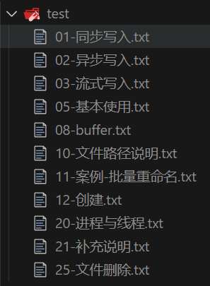{:width=250 height=250}
现要对文件序号进行更改，使其连续
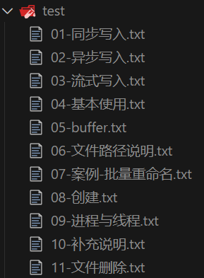{:width=250 height=250}
思路：在循环外设置索引，标识是第几个文件
```js
const fs = require('fs');
const file_list = fs.readdirSync('./test'); //所有的文件
let index = 1;
file_list.forEach(file_name => { //遍历数组
    const file_name_list = file_name.split('-'); //拆分
    file_name_list.shift(); //删除第一个元素，即原有序号
    const num = index < 10 ? '0' + index : '' + index; //新序号
    index++; //更新序号
    const new_file_name = [num, ...file_name_list].join('-'); //合并得到新文件名
    fs.renameSync(`./test/${file_name}`, `./test/${new_file_name}`); //重命名
});
```
### path模块
提供了操作路径的功能
| API                                | 说明                       |
| ---------------------------------- | -------------------------- |
| `path.resolve(绝对路径, 相对路径)` | 拼接规范的绝对路径（常用） |
| `path.sep`                         | 获取路径分隔符             |
| `path.parse(路径)`                 | 解析路径                   |
| `path.basename(路径)`              | 获取文件名（包括后缀）     |
| `path.dirname(路径)`               | 获取文件所在目录名         |
| `path.extname(路径)`               | 获取文件扩展名             |

详细介绍：
- `path.resolve(绝对路径, 相对路径)`其中绝对路径一般都是`__dirname`，它可以实现[文件路径说明](#文件路径说明)中提到的拼接功能
    ```js
    const path = require('path');
    console.log(__dirname + './test.txt'); //不规范的拼接（路径中/和\混用）
    //C:\Users\17185\Desktop\NodeJS\test./test.txt
    console.log(path.resolve(__dirname, './test.txt')); //常用方法
    //C:\Users\17185\Desktop\NodeJS\test\test.txt
    console.log(path.resolve(__dirname, 'test.txt')); //可以省略./
    //C:\Users\17185\Desktop\NodeJS\test\test.txt
    console.log(path.resolve('/test.txt')); //只传一个绝对路径
    //C:\test.txt
    console.log(path.resolve('/a', 'b.txt')); //也可以
    //C:\a\b.txt
    console.log(path.resolve(__dirname, '/a.txt')); //不行，函数会只识别传入的最后一个绝对路径
    //C:\a.txt
    console.log(path.resolve(__dirname, '/a', 'b.txt')); //第一个绝对路径__dirname被忽略
    //C:\a\b.txt
    ```
- `path.sep`获取操作系统的路径分隔符（Windows是`\`，Linux是`/`）
    ```js
    const path = require('path');
    console.log(path.sep); //返回'\'
    ```
- `path.parse(路径)`解析路径，以对象形式返回路径的相关信息
    ```js
    const path = require('path');
    console.log(path.parse(__filename)); //也可以：
    console.log(path.parse('C:\\Users\\17185\\Desktop\\NodeJS\\test\\test.js')); //注意是两个\（转义）
    ```
    ```
    {
        root: 'C:\\', 所在根目录
        dir: 'C:\\Users\\17185\\Desktop\\NodeJS\\test', 所在文件夹
        base: 'test.js', 文件名（包括后缀）
        ext: '.js', 后缀
        name: 'test' 文件名（不包括后缀）
    }
    ```
    也可以传入相对路径，但结果不完整
    ```js
    const path = require('path');
    console.log(path.parse('./test.js'));
    //{ root: '', dir: '.', base: 'test.js', ext: '.js', name: 'test' }
    ```
- `path.basename(路径)`获取文件名（包括后缀）
- `path.dirname(路径)`获取文件所在文件夹
- `path.extname(路径)`获取文件后缀
    ```js
    const path = require('path');
    const file_name = 'C:\\Users\\17185\\Desktop\\NodeJS\\test.js';
    console.log(path.basename(file_name)); //test.js
    console.log(path.dirname(file_name)); //C:\Users\17185\Desktop\NodeJS
    console.log(path.extname(file_name)); //.js
    ```
### http模块
##### HTTP基本概念
HTTP(hypertext transfer protocol)**超文本传输协议**：对浏览器和服务器间的通信作约束
- **请求**：浏览器向服务器发送数据，发送的内容称为请求报文
- **响应**：服务器给浏览器返回结果，返回的内容称为响应报文

为获取请求与响应的具体内容，这里安装fiddler软件，它可以作为浏览器和服务器间通信的中介，监听请求/响应内容
安装完后，点击`tools`->`options`->`https`->`decrypt https traffic`，之后在弹出的对话框中点击yes；若没有弹出对话框，就点击`action`->`trust root certificate`。最后重启fiddler
{:width=250 height=250}
为更好的监听，建议将下边栏中的`all processes`改为`web browsers`，这样就只监听浏览器中的请求与响应
{:width=250 height=250}
注意：建议使用chrome来进行测试，其它浏览器可能监听不到
双击左侧框中的某条报文，可以在右边框中查看详细信息，其中上面是请求、下面是响应。如果想要看报文原文，点击右侧栏上方的`Raw`（中文版是`数据`）。如果有乱码，就点击`click to decode`
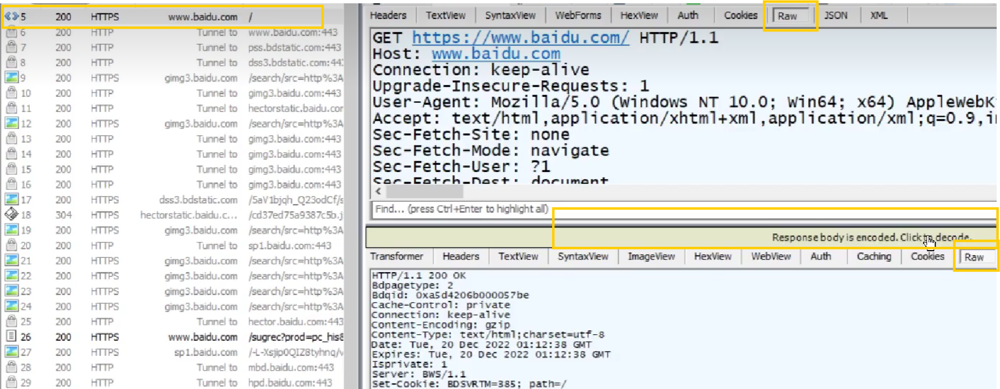{:width=250 height=250}
###### 请求
**请求报文结构**：
- 第一行：请求行
- 第二行~空行：请求头
- 之后的部分：请求体（不一定有）

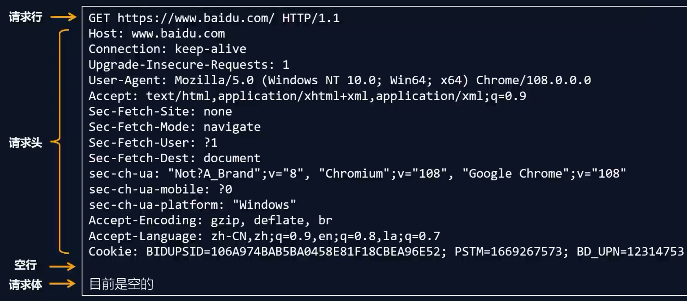{:width=300 height=300}
