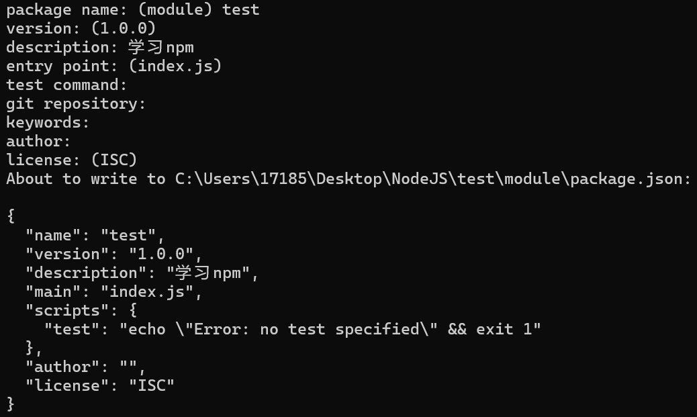
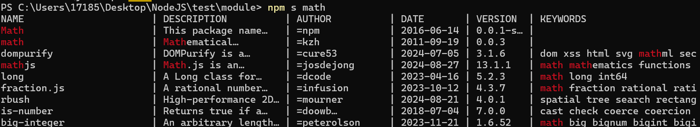
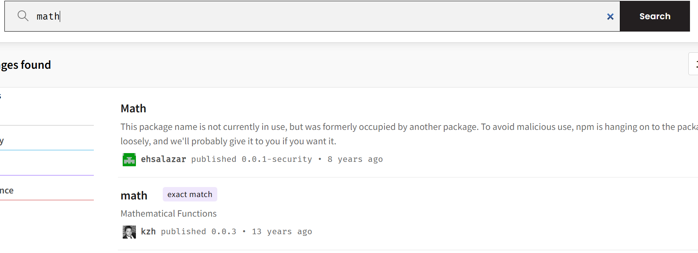
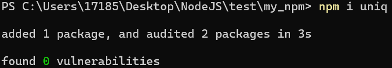
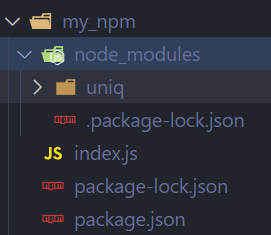
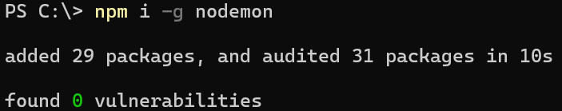
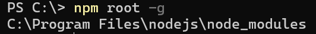
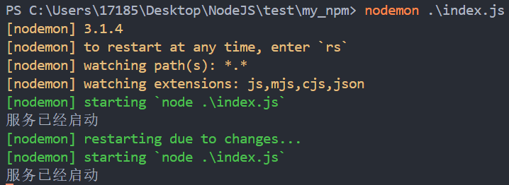

<a id="mulu">目录</a>
<a href="#mulu" class="back">回到目录</a>
<style>
    .back{width:40px;height:40px;display:inline-block;line-height:20px;font-size:20px;background-color:lightyellow;position: fixed;bottom:50px;right:50px;z-index:999;border:2px solid pink;opacity:0.3;transition:all 0.3s;color:green;}
    .back:hover{color:red;opacity:1}
    img{vertical-align:bottom;}
</style>

<!-- @import "[TOC]" {cmd="toc" depthFrom=3 depthTo=6 orderedList=false} -->

<!-- code_chunk_output -->

- [模块化](#模块化)
    - [暴露数据](#暴露数据)
    - [导入模块](#导入模块)
- [包管理工具](#包管理工具)
    - [npm](#npm)
      - [初始化](#初始化)
      - [搜索与下载包](#搜索与下载包)
      - [导入包](#导入包)
      - [生产环境与开发环境](#生产环境与开发环境)
      - [全局安装](#全局安装)

<!-- /code_chunk_output -->

<!-- 打开侧边预览：f1->Markdown Preview Enhanced: open...
只有打开侧边预览时保存才自动更新目录 -->

写在前面：此笔记来自b站课程[尚硅谷Node.js零基础视频教程](https://www.bilibili.com/video/BV1gM411W7ex) P67-P / [资料下载](https://pan.baidu.com/share/init?surl=sDOMvUdY9UF3mlJ7ujOADg&pwd=s3wj#list/path=%2F) 提取码：s3wj

### 模块化
模块化：将一个复杂的程序文件依据一定规则拆分成多个文件。其中拆分出的每个文件就是一个模块，模块内部数据是私有的，也可以提供接口（暴露数据）让其它模块使用
好处：减少变量命名冲突、高复用性、高维护性
##### 暴露数据
为方便说明，这里定义`值名`为某个模块中的值名称，`调用值名`为在其它文件中调用该模块中值时使用的值名称
- `module.exports`：
  - `module.exports = 值名`将指定值暴露除去，此时调用值名与值名相同。在需要调用该值的js文件中，使用`const 调用值名=require('模块名')`即可获得该值
    注：这种方法只能暴露1个值
  - `module.exports = {调用值名1:值名1, 调用值名2:值名2, ...}`将多个值暴露出去，调用值名可不写，默认与值名相同。此时调用该模块的方法同前面讲过的模块调用

  例：创建`my_func.js`文件作为模块文件
    ```js
    //my_func.js
    function func_a() {
        console.log("我是a函数");
    }
    module.exports = func_a;
    //其它js文件调用该函数
    const func_a = require('./my_func.js');
    func_a(); //我是a函数
    ```
    ```js
    //my_func.js
    function func_a() {
        console.log("我是a函数");
    }
    function func_b() {
        console.log("我是b函数");
    }
    module.exports = {
        func_a,
        my_func_b: func_b
    };
    //其它js文件调用该函数
    const my_func = require('./my_func.js');
    my_func.func_a(); //我是a函数
    my_func.my_func_b(); //我是b函数
    ```
- `exports.调用值名 = 值名`这种方法可以暴露多个函数
    ```js
    //my_func.js
    function func_a() {
        console.log("我是a函数");
    }
    function func_b() {
        console.log("我是b函数");
    }
    exports.func_a = func_a;
    exports.my_func_b = func_b;
    //其它js文件调用该函数
    const my_func = require('./my_func.js');
    my_func.func_a(); //我是a函数
    my_func.my_func_b(); //我是b函数
    ```

注意：
- 暴露的数据可以是任意类型的
    ```js
    //my_func.js
    str = '我是字符串';
    num = 100;
    exports.str = str;
    exports.num = num;
    //其它js文件调用该函数
    const my_func = require('./my_func.js');
    console.log(my_func.str, my_func.num); //我是字符串 100
    ```
- 不能使用`exports = 值名`的形式，因为`exports`实际上是指向`module.exports`的指针，而`module.exports`是一个空对象，如果这样写就是将该指针覆盖了，而`exports.调用值名 = 值名`则是向`module.exports`中添加数据
##### 导入模块
**使用require导入模块的注意事项**：
- 如果是nodejs内置模块，直接写模块名即可；而对于自己创建的模块，导入时建议写相对路径，且不能省略`./`和`../`
    注：这里的相对路径不受工作目录的影响，都是以文件目录为准
- js和json文件引入时可以省略后缀（如果同名，优先引入js），json文件引入时会自动转为对象形式。c/c++编写的`.node`扩展文件也可省略后缀（不常用）
- 导入未知类型的文件或没有后缀的文件，会默认按js文件处理

**导入文件夹**：当导入的路径是一个文件夹时，
- 会首先检测文件夹中`package.json`中`main`属性对应的文件，如果存在则导入这些文件，如果不存在其中某个文件则报错
- 如果没有`package.json`或`package.json`中没有`main`属性，则会尝试导入文件夹中`index.js`和`index.json`，如果不存在这两个文件则报错

```js
//module文件夹下app.js
module.exports = "我是一个模块";
//module文件夹下package.json
{
    "main": "./app.js"
}
//其它js文件调用该文件夹
const m = require('./module');
console.log(m); //我是一个模块
```
```js
//module文件夹下index.js
module.exports = "我是一个index.js";
//其它js文件调用该文件夹
const m = require('./module');
console.log(m); //我是一个index.js
```

---

**require导入自定义模块的基本流程**：
- 将相对路径转为绝对路径，定位文件
- 缓存检测：检测之前有没有导入过这个文件，如果导入过，就直接利用缓存值，不用重复执行这个文件了
- 读取代码
- 将代码封装成一个函数并执行（自执行函数）
- 缓存模块的值
- 返回`module.exports`的值

```js
//module文件夹下index.js
module.exports = "我是一个index.js";
console.log(arguments.callee.toString()); //输出自执行函数内容
//其它js文件调用该文件夹
const m = require('./module');
const m1 = require('./module');
```
```
function (exports, require, module, __filename, __dirname) {
module.exports = "我是一个index.js";
console.log(arguments.callee.toString()); //输出自执行函数内容

}
```
导入了两次模块，只输出了一次自执行函数，这是因为第二次导入模块时使用了第一次导入的缓存

---

补充：`module.exports`、`exports`、`require`这些都是CommonJS模块化规范中的内容，而Node.js是CommonJS模块化规范的具体实现。Nodejs与CommonJS的关系类似于JavaScript与ECMAScript
### 包管理工具
##### npm
npm是nodejs内置的包管理工具，安装nodejs时会默认安装npm
###### 初始化
创建一个空文件夹，在其中打开命令行，输入`npm init`，其作用是将该文件夹变成我们自己创建的一个包，并引导我们创建`package.json`文件，它是包的配置文件，每个包都必须有
{:width=300 height=300}
从上到下依次为`包名称`、`版本号`、`入口点`、`包的描述`、`测试命令`、`git仓库`、`关键字`、`作者名字`、`开源证书`，括号内的为默认值，按回车即可使用默认值，最后输入yes即可创建一个`package.json`文件
注意：
- 包名不能用中文、大写字母，默认是文件夹名称，因此文件夹名称也不能是中文、大写字母
- 版本号要用`x.x.x`的形式，x必须是数字
- `package.json`也可手动创建并修改
- 使用`npm init -y`可以快速创建`package.json`
- [更多关于开源证书](http://www.ruanyifeng.com/blog/2011/05/how_to_choose_free_software_licenses.html)
###### 搜索与下载包
**搜索包**：
- 命令行中输入`npm s 关键字`
    {:width=150 height=150}
- 通过[npm官网](www.npmjs.com)搜索
    {:width=200 height=200}

**安装包**：`npm i 包名`
运行后文件夹下会增加两个资源：
- `node_modules`文件夹：存放下载的包
- `package-lock.json`包的锁文件：用来锁定包的版本，确保每次安装时包的版本相同

注意：安装包前需要[初始化](#初始化)该文件夹
以安装`uniq`包为例：
{:width=80 height=80}
在文件夹下新建一个`index.js`：
```js
const uniq = require("uniq"); //导入uniq包
let arr = [1, 2, 1, 2, 3, 5, 5, 1, 4, 4]; //uniq包可以对数组去重
console.log(uniq(arr)); //[ 1, 2, 3, 4, 5 ]
```
安装`uniq`包后，uniq就是我们创建的包的一个**依赖包**，简称依赖。比如我们创建了一个包A，A中安装了包B，则B是A的一个依赖包，A依赖B
###### 导入包
require导入npm包的基本流程：`require("包名")`
- 在当前文件夹下的`node_modules`文件夹中找同名文件夹，找到后进入该文件夹，读取其中`package.json`中`main`属性对应的js文件，将这个文件引入
- 在上级目录的`node_modules`文件夹中使用上面的方法找，直到磁盘根目录

例：对于如图所示的文件结构
{:width=150 height=150}
在index.js中导入uniq包：
```js
//以下三种方式都可以
const uniq = require("uniq");
const uniq = require('./node_modules/uniq');
const uniq = require('./node_modules/uniq/uniq.js');
```
在实际操作中，一般都用`require("uniq")`这种方式，因为它可以自动搜索js文件的位置
###### 生产环境与开发环境
**开发环境**：写代码的环境，其中的项目只能编写者自己访问
**生产环境**：项目代码正式运行的环境，一般指服务器，每个客户都可访问
**开发依赖**：只在开发阶段使用的依赖。例如将`.less`转为`.css`的`less`包，只需在开发阶段使用
**生产依赖**：既在开发阶段使用，也在最终运行阶段使用。例如提供jq功能的`jquery`包，在全程都需要

| 类型     | 命令            | 补充                                                                                  |
| -------- | --------------- | ------------------------------------------------------------------------------------- |
| 生产依赖 | `npm i -S 包名` | `-S`相当于`--save`，是默认值<br>包信息保存在`package.json`中`dependencies`属性        |
| 开发依赖 | `npm i -D 包名` | `-D`相当于`--save-dev`，是默认值<br>包信息保存在`package.json`中`devDependencies`属性 |

这两种依赖都会存入`node_modules`文件夹中，都是通过require引入
###### 全局安装
`npm i -g 包名`安装后，可在任意位置的命令行调用该包
注意：
- 全局安装命令不受工作目录的影响，可在任意位置执行安装命令
- 使用`npm root -g`查看全局安装包
- 不是所有的包都适合全局安装。只有全局类的工具才适合，可通过查看包的官方文档来确定安装方式
- 全局包都是提供命令行命令来执行，不能使用require引入

例：安装`nodemon`包，该包提供`nodemon`命令，可以自动重启node程序
{:width=80 height=80}
{:width=32 height=32}
启动一个HTTP服务：
```js
const http = require('http');
const server = http.createServer((request, response) => { //创建服务对象
    response.end('hello http server');
});
server.listen(9000, () => {
    console.log("服务已经启动");
});
```
在终端中输入`nodemon js文件路径`
此时当这个文件夹下任一js/mjs/cjs/json文件改变时，就会自动重启服务，无需CTRL+c再重启
{:width=150 height=150}
