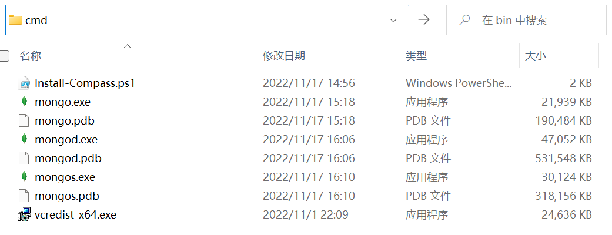
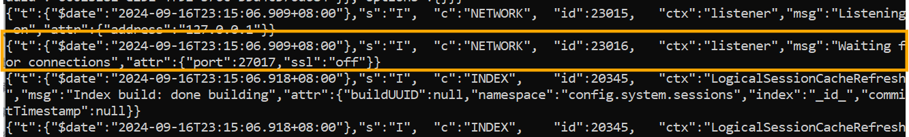
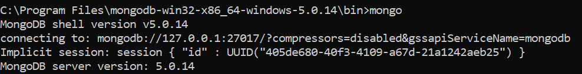
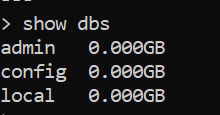

<a id="mulu">目录</a>
<a href="#mulu" class="back">回到目录</a>
<style>
    .back{width:40px;height:40px;display:inline-block;line-height:20px;font-size:20px;background-color:lightyellow;position: fixed;bottom:50px;right:50px;z-index:999;border:2px solid pink;opacity:0.3;transition:all 0.3s;color:green;}
    .back:hover{color:red;opacity:1}
    img{vertical-align:bottom;}
</style>

<!-- @import "[TOC]" {cmd="toc" depthFrom=3 depthTo=6 orderedList=false} -->

<!-- code_chunk_output -->

- [MongoDB](#mongodb)
    - [简介与安装](#简介与安装)

<!-- /code_chunk_output -->

<!-- 打开侧边预览：f1->Markdown Preview Enhanced: open...
只有打开侧边预览时保存才自动更新目录 -->

写在前面：此笔记来自b站课程[尚硅谷Node.js零基础视频教程](https://www.bilibili.com/video/BV1gM411W7ex) P130-P / [资料下载](https://pan.baidu.com/share/init?surl=sDOMvUdY9UF3mlJ7ujOADg&pwd=s3wj#list/path=%2F) 提取码：s3wj

### MongoDB
##### 简介与安装
MongoDB是一个基于分布式文件存储的、非关系型的数据库，与使用文件管理数据相比，数据库的速度更快、扩展性更强、安全性更高
与其它的数据库相比，MongoDB的操作语法与js更相似
**MongoDB的三个核心概念**：
- 数据库(database)：MongoDB中可以创建多个数据库，数据库中可以存放多个集合
- 集合(collection)：类似于js的数组，集合中可以存放多个文档
- 文档(document)：是数据库中的最小单位，类似于js中的对象；对象中的属性有时也被称为“字段”

例如对于下面的json结构：
```
{
  "accounts": [
    {
      "id": "3-YLju5f3",
      "title": "买电脑"
    },
    {
      "id": "3-YLju5f4",
      "title": "请女朋友吃饭"
    }
  ],
  "users":[
    {
      "id": 1
    },
    {
      "id": 2
    }
  ]
}
```
整个json看成一个数据库，则`"accounts"`和`"users"`就是集合，它们中的对象`{"id": "3-YLju5f3","title": "买电脑"}`和`{"id": 1}`就是文档，`"id"`和`"title"`就是字段
**注意，一般情况下**：
- 一个项目使用一个数据库
- 一个集合存储同一类的数据

---

[官网下载](https://www.mongodb.com/try/download/community)，下载5.0.14，建议zip格式
[5.0.14版本下载](https://www.cnblogs.com/htj10/p/17934098.html)
- 将压缩包解压，并移动到`C:\Program Files`下
- 创建`C:\data\db`目录，MongoDB会将数据默认保存在这个文件夹
- 在mongodb-win32-x86_64-windows-5.0.14中bin文件夹下启动命令行，使用cmd（在文件路径那个输入框中直接输入cmd后回车）运行命令`mongod`（如果是powershell需要先配环境变量）
    {:width=200 height=200}
    当看到"Waiting for connections"（id为23016的那条信息）时，就说明数据库服务已经启动
    {:width=120 height=120}
- 再在此处打开另一个cmd，运行命令`mongo`
    {:width=80 height=80}
    此时这个终端就与刚才启动的服务建立了连接，可以看到此时命令提示符由路径变成了`>`，说明进入了数据库操作状态
- 在`mongo`的那个终端中接着输入`show dbs`检测连接是否成功
    {:width=70 height=70}
    实际上，当输入这个命令时，终端会向数据库服务端发送一个请求，数据库服务端执行查询命令后，将结果返回给终端
- 为方便后续启动服务，将bin目录添加到环境变量中

注意：**不要选中`mongod`那个终端（服务端）窗口中的内容**，选中时数据库服务会暂停，如果不小心选中，可以按回车键取消选中，取消选中后服务自动恢复
