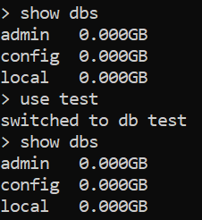
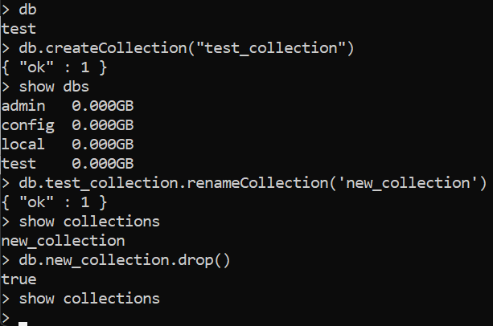
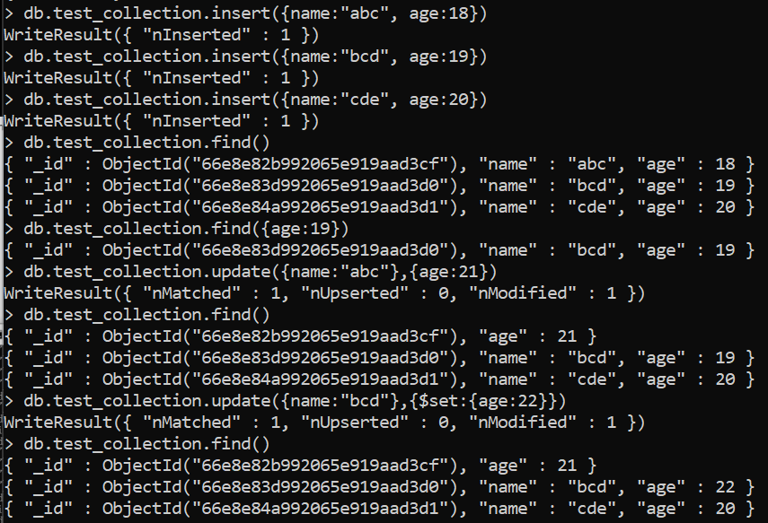
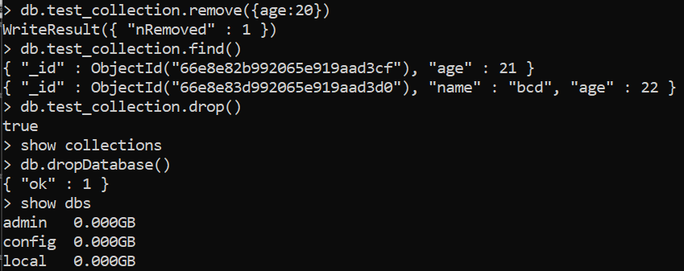
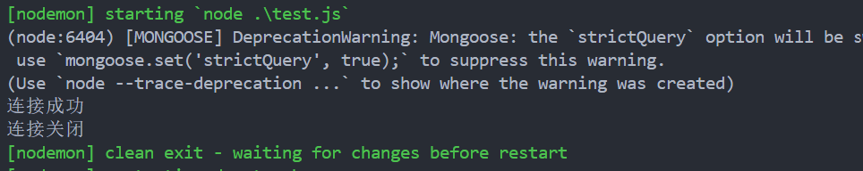
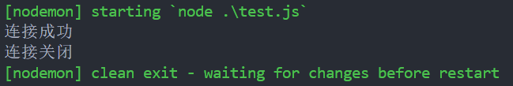
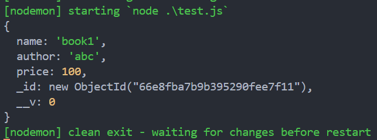

<a id="mulu">目录</a>
<a href="#mulu" class="back">回到目录</a>
<style>
    .back{width:40px;height:40px;display:inline-block;line-height:20px;font-size:20px;background-color:lightyellow;position: fixed;bottom:50px;right:50px;z-index:999;border:2px solid pink;opacity:0.3;transition:all 0.3s;color:green;}
    .back:hover{color:red;opacity:1}
    img{vertical-align:bottom;}
</style>

<!-- @import "[TOC]" {cmd="toc" depthFrom=3 depthTo=6 orderedList=false} -->

<!-- code_chunk_output -->

- [MongoDB](#mongodb)
    - [简介与安装](#简介与安装)
    - [常用命令（命令行）](#常用命令命令行)
    - [Mongoose](#mongoose)
      - [连接数据库](#连接数据库)
      - [插入文档](#插入文档)

<!-- /code_chunk_output -->

<!-- 打开侧边预览：f1->Markdown Preview Enhanced: open...
只有打开侧边预览时保存才自动更新目录 -->

写在前面：此笔记来自b站课程[尚硅谷Node.js零基础视频教程](https://www.bilibili.com/video/BV1gM411W7ex) P130-P / [资料下载](https://pan.baidu.com/share/init?surl=sDOMvUdY9UF3mlJ7ujOADg&pwd=s3wj#list/path=%2F) 提取码：s3wj

### MongoDB
##### 简介与安装
MongoDB是一个基于分布式文件存储的、非关系型的数据库，与使用文件管理数据相比，数据库的速度更快、扩展性更强、安全性更高
与其它的数据库相比，MongoDB的操作语法与js更相似
**MongoDB的三个核心概念**：
- 数据库(database)：MongoDB中可以创建多个数据库，数据库中可以存放多个集合
- 集合(collection)：类似于js的数组，集合中可以存放多个文档
- 文档(document)：是数据库中的最小单位，类似于js中的对象；对象中的属性有时也被称为“字段”

例如对于下面的json结构：
```
{
  "accounts": [
    {
      "id": "3-YLju5f3",
      "title": "买电脑"
    },
    {
      "id": "3-YLju5f4",
      "title": "请女朋友吃饭"
    }
  ],
  "users":[
    {
      "id": 1
    },
    {
      "id": 2
    }
  ]
}
```
整个json看成一个数据库，则`"accounts"`和`"users"`就是集合，它们中的对象`{"id": "3-YLju5f3","title": "买电脑"}`和`{"id": 1}`就是文档，`"id"`和`"title"`就是字段
**注意，一般情况下**：
- 一个项目使用一个数据库
- 一个集合存储同一类的数据

---

[官网下载](https://www.mongodb.com/try/download/community)，下载5.0.14，建议zip格式
[5.0.14版本下载](https://www.cnblogs.com/htj10/p/17934098.html)
- 将压缩包解压，并移动到`C:\Program Files`下
- 创建`C:\data\db`目录，MongoDB会将数据默认保存在这个文件夹
- 在mongodb-win32-x86_64-windows-5.0.14中bin文件夹下启动命令行，使用cmd（在文件路径那个输入框中直接输入cmd后回车）运行命令`mongod`（如果是powershell需要先配环境变量）
    {:width=200 height=200}
    当看到"Waiting for connections"（id为23016的那条信息）时，就说明数据库服务已经启动
    {:width=120 height=120}
- 再在此处打开另一个cmd，运行命令`mongo`
    {:width=80 height=80}
    此时这个终端就与刚才启动的服务建立了连接，可以看到此时命令提示符由路径变成了`>`，说明进入了数据库操作状态
- 在`mongo`的那个终端中接着输入`show dbs`检测连接是否成功
    {:width=70 height=70}
    实际上，当输入这个命令时，终端会向数据库服务端发送一个请求，数据库服务端执行查询命令后，将结果返回给终端
- 为方便后续启动服务，将bin目录添加到环境变量中

注意：**不要选中`mongod`那个终端（服务端）窗口中的内容**，选中时数据库服务会暂停，如果不小心选中，可以按回车键取消选中，取消选中后服务自动恢复
##### 常用命令（命令行）
使用较少，了解即可
**数据库命令**：
- `show dbs`显示所有的数据库
- `use 数据库`切换到指定的数据库，若数据库不存在会自动创建
- `db`显示当前所在的数据库
- `db.dropDatabase()`删除当前所在数据库

**集合命令**：
- `db.createCollection('集合名')`创建集合
- `show collections`显示当前数据库中的集合
- `db.集合名.drop()`删除指定集合
- `db.集合名.renameCollection('新集合名')`重命名指定集合

**文档命令**：
- `db.集合名.insert(文档对象)`插入文档
  注：插入时mongodb会自动生成一个键值对`_id: xxx`，它用于唯一标识文档
- `db.集合名.find(查询条件)`根据查询条件查询文档，若不写查询条件则展示全部文档
- `db.集合名.update(查询条件, 新文档对象)`更新文档
  `db.集合名.update(查询条件, {$set:新文档对象})`只更新新文档对象中的属性，其它属性保留
- `db.集合名.remove(查询条件)`删除文档

{:width=150 height=150}
注：新创建的空的数据库不显示，需要添加一些数据
{:width=250 height=250}
{:width=350 height=350}
{:width=200 height=200}
补充：在某些项目中，当想“删除”某些数据时，不会真正将数据从数据库中删除，而是作“伪删除”，即给该条文档加一个标记，比如加一个属性`is_deleted`，为true时该文档就被标记删除
##### Mongoose
是一个对象文档模型库，方便我们使用代码操作MongoDB数据库
使用`npm i mongoose@6.9.2`安装6.9.2版本
###### 连接数据库
先在终端中启动mongodb服务
```js
const mongoose = require("mongoose");
mongoose.connect("mongodb://主机名:端口号/数据库名称"); //若指定的数据库不存在则自动创建
mongoose.connection.on("open",()=>{
  //连接成功的回调函数（通常是功能性代码）
});
mongoose.connection.on("error",()=>{
  //连接失败的回调函数
});
mongoose.connection.on("close",()=>{
  //连接关闭的回调函数
});
mongoose.disconnect(); //关闭连接
```
例：
```js
const mongoose = require("mongoose");
mongoose.connect("mongodb://127.0.0.1:27017/test");
mongoose.connection.on("open", () => {
    console.log("连接成功");
});
mongoose.connection.on("error", () => {
    console.log("连接失败");
});
mongoose.connection.on("close", () => {
    console.log("连接关闭");
});
setTimeout(() => { //5s后关闭连接
    mongoose.disconnect();
}, 5000);
```
{:width=120 height=120}
补充：
- `MONGOOSE] DeprecationWarning: Mongoose: the strictQuery option`警告解除方法：在导入包后添加`mongoose.set('strictQuery', false)`
- 官方推荐绑定`open`（连接成功）回调函数时使用`once`而不是`on`，区别是`once`只执行一次回调函数。这是因为我们常常在其中写一些功能性代码，如启动HTTP监听，如果第一次连接成功后，数据库服务中断，重新连接成功后就不能再设置监听，因此我们想让open回调函数只执行一次

```js
const mongoose = require("mongoose");
mongoose.set('strictQuery', false); //解除警告
mongoose.connect("mongodb://127.0.0.1:27017/test");
mongoose.connection.once("open", () => { //使用once
    console.log("连接成功");
});
mongoose.connection.on("error", () => {
    console.log("连接失败");
});
mongoose.connection.on("close", () => {
    console.log("连接关闭");
});
setTimeout(() => { //5s后关闭连接
    mongoose.disconnect();
}, 5000);
```
{:width=70 height=70}
###### 插入文档
**后续所有的功能性代码都在open回调函数中写**
```js
//创建文档的结构对象，用于约束文档值类型
let schema = new mongoose.Schema({
  文档属性: 文档值类型,
  ...
});
//创建模型对象
let model = mongoose.model(集合名称, schema);
model.create(要插入的数据对象, (err, data)=>{
  //err是错误对象
  //data是插入后的文档对象
});
```
例：
```js
const mongoose = require("mongoose");
mongoose.set('strictQuery', false); //解除警告
mongoose.connect("mongodb://127.0.0.1:27017/test");
mongoose.connection.once("open", () => {
    const book_schema = new mongoose.Schema({ //文档结构对象
        name: String,
        author: String,
        price: Number
    });
    const model = mongoose.model("books", book_schema); //模型对象
    model.create({
        name: "book1",
        author: "abc",
        price: "100"
    }, (err, data) => {
        if (err) {
            console.log(err);
            return;
        }
        console.log(data);
        mongoose.disconnect(); //项目运行时，不会在这里关闭连接
    });
});
```
{:width=150 height=150}

