<a id="mulu">目录</a>
<a href="#mulu" class="back">回到目录</a>
<style>
    .back{width:40px;height:40px;display:inline-block;line-height:20px;font-size:20px;background-color:lightyellow;position: fixed;bottom:50px;right:50px;z-index:999;border:2px solid pink;opacity:0.3;transition:all 0.3s;color:green;}
    .back:hover{color:red;opacity:1}
    img{vertical-align:bottom;}
</style>

<!-- @import "[TOC]" {cmd="toc" depthFrom=3 depthTo=6 orderedList=false} -->

<!-- code_chunk_output -->

- [会话控制](#会话控制)
    - [cookie](#cookie)
      - [浏览器操作cookie](#浏览器操作cookie)
      - [express框架中的cookie](#express框架中的cookie)
    - [session](#session)
      - [基本使用](#基本使用)
      - [记账本案例](#记账本案例)

<!-- /code_chunk_output -->

<!-- 打开侧边预览：f1->Markdown Preview Enhanced: open...
只有打开侧边预览时保存才自动更新目录 -->

写在前面：此笔记来自b站课程[尚硅谷Node.js零基础视频教程](https://www.bilibili.com/video/BV1gM411W7ex) P168-P200 / [资料下载](https://pan.baidu.com/share/init?surl=sDOMvUdY9UF3mlJ7ujOADg&pwd=s3wj#list/path=%2F) 提取码：s3wj

### 会话控制
**会话**：客户端向服务端发送一次请求，服务端响应一次信息，就是一次会话
HTTP是一种无状态的协议，无法区分多次请求是否来自同一个客户端，即无法区分用户。这时就需要会话控制解决该问题，常见的会话控制有三种：
\- [cookie](#cookie)
\- [session](#session)
\- token
##### cookie
cookie是HTTP服务器发送到用户浏览器并保存在本地的一小块数据，是按照域名划分的，形式类似于键值对
**特点**：浏览器向服务器发送请求时，会自动将**当前域名下**可用的cookie设置在请求头中，传递给服务器
这个请求头的名称也叫`cookie`，因此也可将cookie理解成一个HTTP请求头
**运行流程**：以登录操作为例
- 在浏览器输入账号密码后，该信息被发送给服务器，服务器校验正确后，将属于该客户的cookie返回（响应头`set-cookie`）
    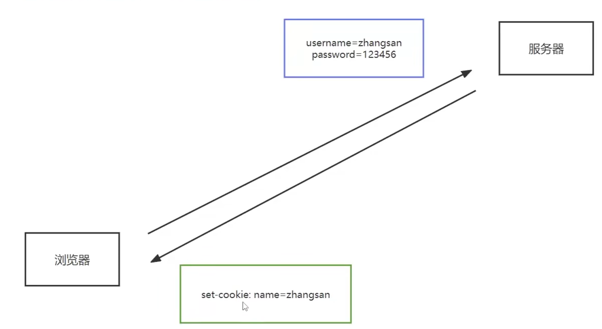{:width=300 height=300}
- 有了cookie之后，再向服务器发送请求时，就会自动携带cookie
    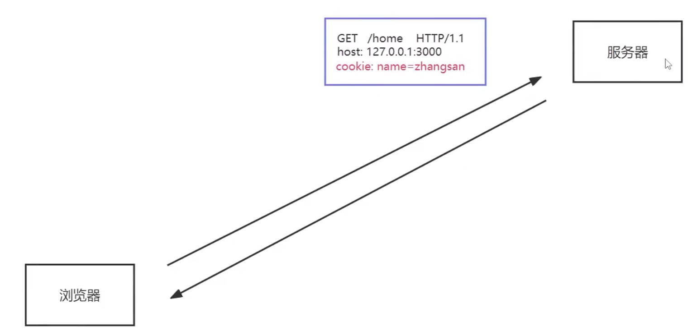{:width=250 height=250}
###### 浏览器操作cookie
使用较少，了解即可
- 禁用所有cookie：打开网页设置页面，搜索`cookie`，找到`管理和删除 cookie 和站点数据`->`阻止第三方Cookie`，开启后很多网页无法正常使用
  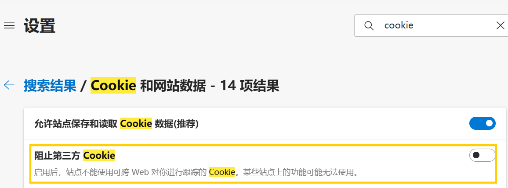{:width=150 height=150}
- 删除cookie：还是上面的页面，点击`查看所有 Cookie和站点数据`，就可以查看和删除各网页的cookie
  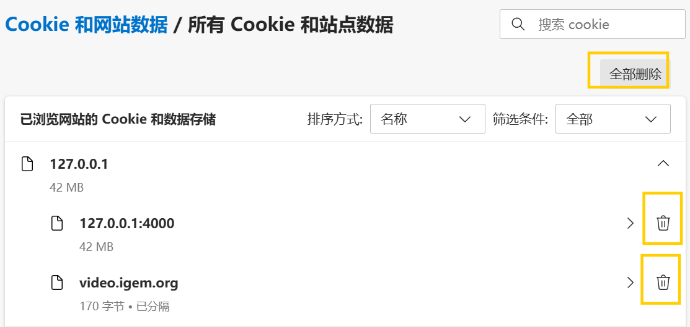{:width=200 height=200}
  如果在一个网站上已经登录，此时删除了该网站的cookie，就无法自动登录了
- 查看cookie：
  - edge：还是上面的`查看所有 Cookie和站点数据`，点击右侧箭头展开
    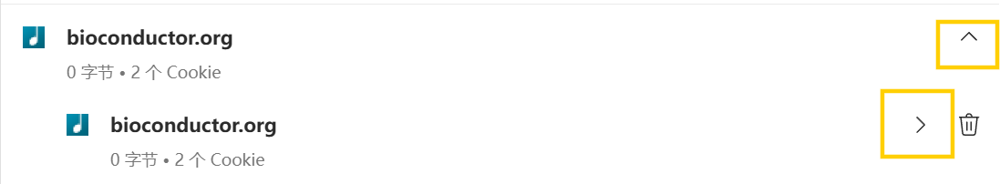{:width=100 height=100}
    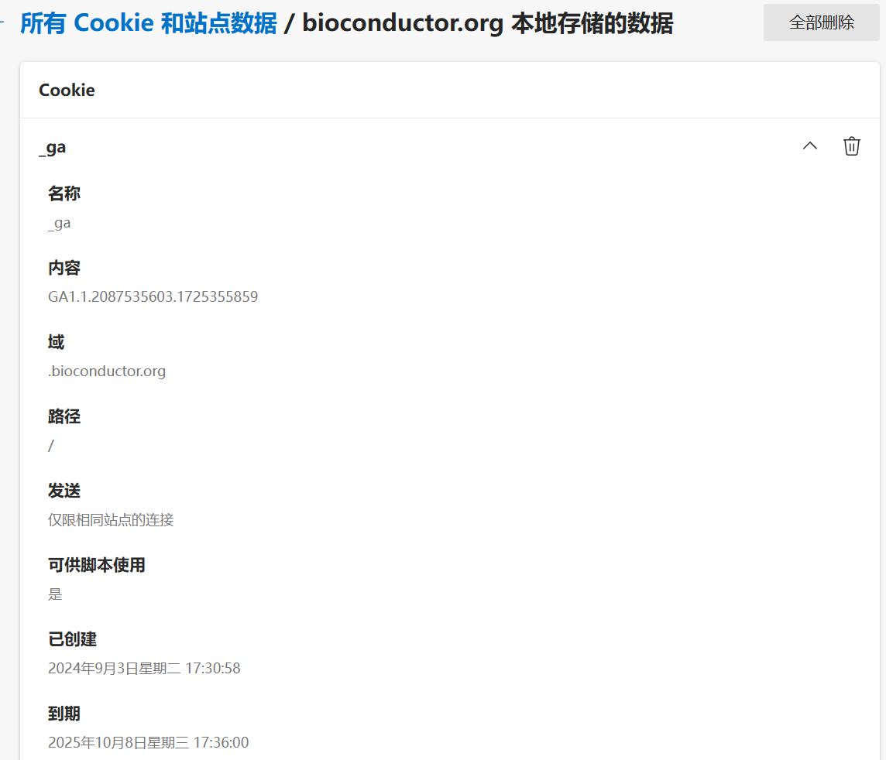{:width=500 height=500}
    其中名称是键、内容是值
  - chrome：新版chrome无法通过简单的方式查看，以下是旧版的操作
    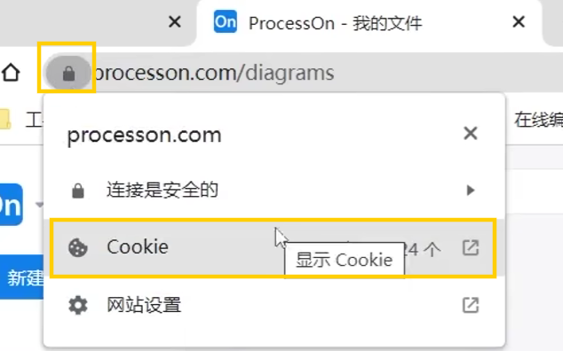{:width=150 height=150}
    点击箭头展开
    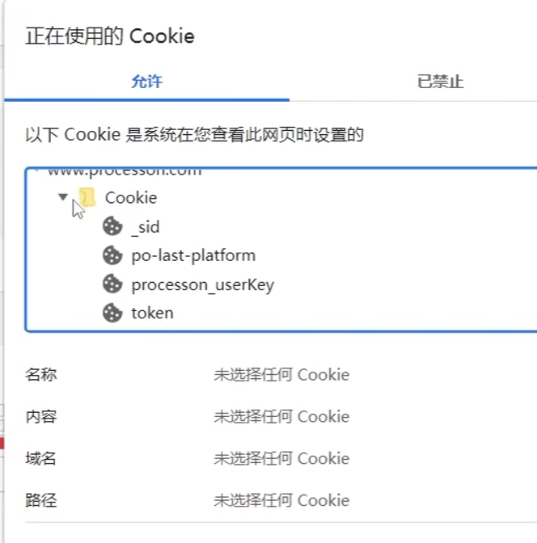{:width=300 height=300}
  - 所有浏览器都可使用的方法：f12->控制台->`document.cookie`
    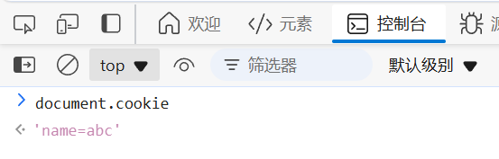{:width=100 height=100}
注：**不同浏览器的cookie不共享**。在一个浏览器中登录一个网页，在另一个浏览器中打开这个网页时仍需登录
为什么打开一个网页，会有显示有其它网页的cookie：网页中有其它的组件也需要cookie，进入一个网页时，会向其它多个网页发送cookie。此网页的cookie被称为**第一方cookie**，其它发送的cookie被称为**第三方cookie**
###### express框架中的cookie
**设置cookie**：
- `res.cookie(cookie名, cookie值)`这种方式在浏览器关闭时销毁cookie
- `res.cookie(cookie名, cookie值, {maxAge: cookie存在时间})`指定cookie的存在时间，单位是ms

**例1**：
```js
const express = require("express");
const app = express();
app.get('/set-cookie', (req, res) => {
    res.cookie('name', 'abc'); //设置cookie
    res.send("home");
});
app.listen(9000);
```
进入`http://127.0.0.1:9000/set-cookie`后，响应头中可以看到`set-cookie`
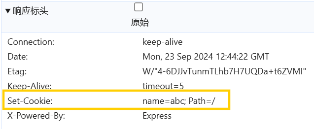{:width=150 height=150}
刷新页面，重新发送请求，就可以在请求体中看见刚才设置的cookie
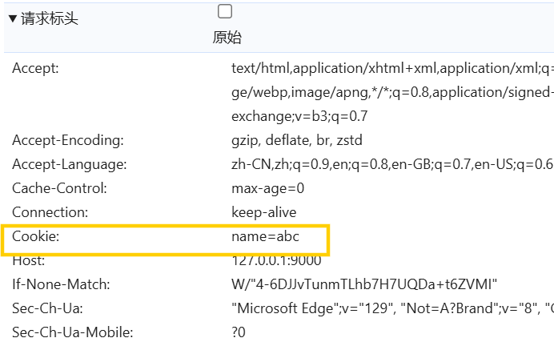{:width=250 height=250}
一个问题：如果访问`http://127.0.0.1:9000`，请求中会不会携带cookie？因为域名没变，所以还是会带这个cookie
**例2**：cookie的生命周期
```js
const express = require("express");
const app = express();
app.get('/set-cookie', (req, res) => {
    res.cookie('name', 'abc', { maxAge: 30*1000 }); //设置cookie生命周期
    res.send("home");
});
app.listen(9000);
```
先进入`http://127.0.0.1:9000/set-cookie`设置cookie，再打开`http://127.0.0.1:9000`，可以在请求头中看到cookie，30s后再次进入，就不会看到cookie了
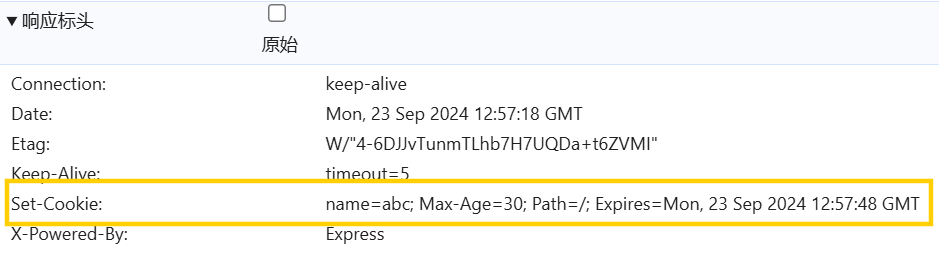{:width=150 height=150}
可以看到cookie的生命周期、过期时间
注：这里面`Max-Age`的单位是s

---

**删除cookie**：`res.clearCookie(cookie名)`
例：
```js
const express = require("express");
const app = express();
app.get('/set-cookie', (req, res) => {
    res.cookie('name', 'abc');
    res.cookie('theme', 'blue');
    res.send("home");
});
app.get('/remove-cookie', (req, res) => {
    res.clearCookie('name', 'abc');
    res.send("删除成功");
});
app.listen(9000);
```
进入`http://127.0.0.1:9000/set-cookie`设置cookie
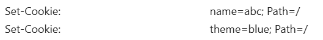{:width=35 height=35}
进入`http://127.0.0.1:9000/remove-cookie`删除cookie
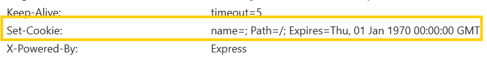{:width=50 height=50}
刷新页面，请求头中cookie只剩下theme
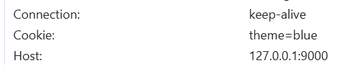{:width=50 height=50}
可以看出删除cookie的原理：将过期时间设为1970年，让cookie过期

---

**读取cookie**：使用包cookie-parser，安装`npm i cookie-parser`，它本质是一个中间件
使用`req.cookies`获取，返回一个对象，键是cookie名，值是cookie值
例：
```js
const express = require("express");
const cookie_parser = require("cookie-parser");
const app = express();
app.use(cookie_parser());
app.get('/set-cookie', (req, res) => {
    res.cookie('name', 'abc');
    res.cookie('theme', 'blue');
    res.send("home");
});
app.get('/get-cookie', (req, res) => {
    console.log(req.cookies);
    res.send(`你好，${req.cookies.name}`);
});
app.listen(9000);
```
进入`http://127.0.0.1:9000/set-cookie`设置cookie，之后访问`http://127.0.0.1:9000/get-cookie`
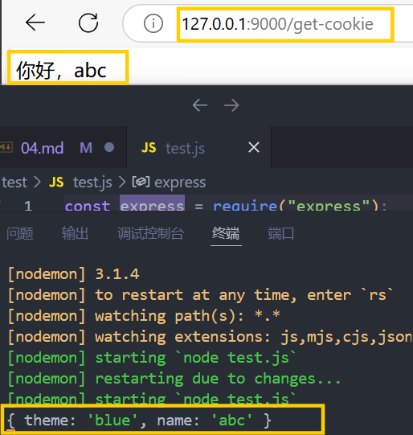{:width=300 height=300}
就可以获取到之前设置的cookie
##### session
基于cookie实现，形式类似于cookie（对象--键值对）
在cookie中，设置完cookie后，访问网址时会发送一个请求头`Cookie`，其中包含例如name/theme等信息；而在session中，它发送一个唯一的sessionid，用于识别每个用户的session数据，这个sessionid的键名可以自定义
**与cookie的区别**：
- 存放位置：cookie在浏览器端，session在服务器端
- 安全性：cookie以明文形式存放在客户端，安全性低；session存放在服务器端，用户无法查看，安全性相对较好
- 存放数据大小：
  - cookie设置内容过多会增大报文体积，影响传输效率，并且浏览器限制单个cookie最大存放量为4K，单个域名下存储数量也有限制
  - session只通过报文传输sid，数据都在服务器中，不影响传输效率，也没有存储限制

使用`express-session`包对session进行操作，使用`connect-mongo`包将session存放到mongodb中（因为默认情况下express-session是将session存到内存中，不易查看）
安装：`npm i express-session connect-mongo`
###### 基本使用
```js
const session = require("express-session");
const mongo_store = require("connect-mongo");
app.use(session({})); //设置中间件
//路由中
req.session.键名 = 键值; //获取/设置session
req.session.destroy(()=>{}); //销毁session，回调函数在删除成功时执行
```
`session({})`中传入的对象参数：
- `name`sessionid的键名，默认为"connect.sid"
- `secret`密钥/签名/加盐，提高加密等级，有了密钥之后，即使知道sid也无法破解
- `saveUninitialized`是否为每次请求都自动设置一个cookie来存储sid，就是如果用户没有用session时，还要不要创建一个session。如设置为false，就是不创建；如果想对匿名用户也做信息记录，就可设为true
- `resave`是否在每次请求时重新保存session。因为session有生命周期，假设生命周期为20min，第一次访问后设置session，正常情况下20min后session过期；在这20min内，客户向服务器发送请求，如果设为true，则发送时更新session，重新计时20min；反之不重新计时，仍会在20min后过期
- `store`存储位置，这里使用`mongo_store.create({mongoUrl:"mongodb://主机名:端口号/数据库名称"})`连接数据库进行存储，它会创建一个名为`session`的集合
- `cookie`服务器响应cookie(set-cookie)的特性
  - `httpOnly`设置为true时，限制前端通过js操作cookie（例如使用`document.cookie`获取当前页面的cookie）
  - `maxAge`session生命周期，单位为ms

为什么用的是`req.session`而不是`res.session`：可以理解为用户发送请求，中间件自动去查询session，将结果返回，之后我们根据结果渲染页面就行了
**例**：
```js
const express = require("express");
const session = require("express-session");
const mongo_store = require("connect-mongo");
const app = express();
app.use(session({
    name: "sid",
    secret: 'jiamizifuchuan',
    saveUninitialized: false,
    resave: true,
    store: mongo_store.create({
        mongoUrl: "mongodb://127.0.0.1:27017/test"
    }),
    cookie: {
        httpOnly: true,
        maxAge: 1000 * 3600 //1h
    }
}));
app.get('/login', (req, res) => { //设置
    //这里通过查询字符串判断是否满足登录条件
    if (req.query.username === "admin" && req.query.password === "woshimima") {
        //设置session
        req.session.username = 'admin';
        //登录成功
        res.send("登录成功");
    } else {
        res.send("登录失败");
    }
});
app.get('/cart', (req, res) => { //获取
    if (req.session.username) {
        res.send(`您好${req.session.username}，这里是购物车页面`);
    } else {
        res.send("您还没有登录");
    }
});
app.get('/logout', (req, res) => { //销毁
    req.session.destroy(() => {
        res.send("退出成功");
    })
});
app.listen(9000);
```
- 登录：进入`http://127.0.0.1:9000/login?username=admin&password=woshimima`登录，可以看到响应头中包含set-cookie，之后再次访问请求头中会一直包含cookie
    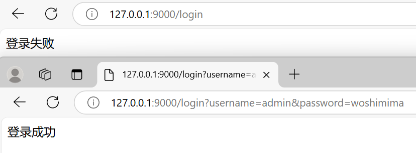{:width=150 height=150}
    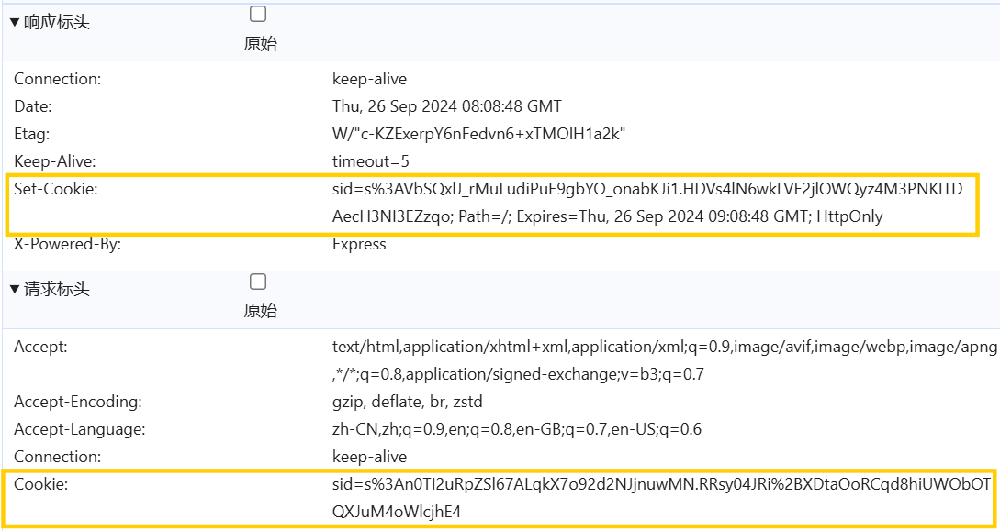{:width=150 height=150}
    数据库也可以看到设置的session，其中包含username项
    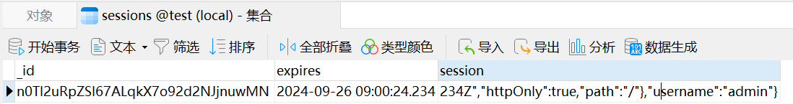{:width=70 height=70}
    注：响应头中的set-cookie只在第一次登录成功时才有，因为后面已经登录，不用再设置
- 访问页面：进入`http://127.0.0.1:9000/cart`
    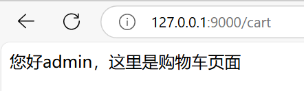{:width=70 height=70}
    请求头中包含cookie(sid)
- 退出登录：进入`http://127.0.0.1:9000/logout`，之后再进入`http://127.0.0.1:9000/cart`，就是未登录状态了
    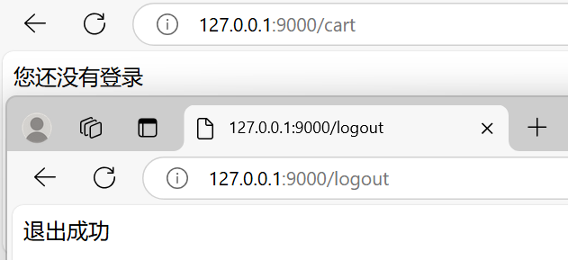{:width=150 height=150}
    虽然请求头中也会包含cookie，但因为数据库中这条sid已被删除，其sid不能与数据库匹配，所以是未登录状态
###### 记账本案例
在routes中新建文件`auth.js`和`login.js`，分别用于实现注册和登录功能，并在app.js中引入
```js
var authRouter = require('./routes/auth');
var loginRouter = require('./routes/login');
app.use('/reg', authRouter);
app.use('/login', loginRouter);
```
在models中新建模型文件`UserModel.js`，用于存放用户的session数据
```js
const mongoose = require('mongoose');
let UserSchema = new mongoose.Schema({
    username: {
        type: String,
        require: true
    },
    password: {
        type: String,
        require: true
    }
});
let UserModel = mongoose.model('users', UserSchema);
module.exports = UserModel;
```
**注册功能**：将注册的静态网页存入views/auth中，该文件夹用于存放注册相关内容
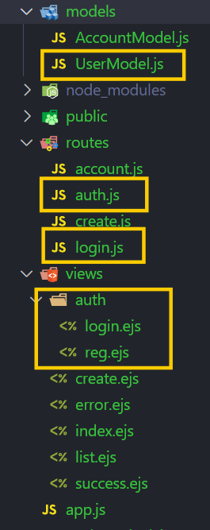{:width=300 height=300}
修改表单：为输入框添加name属性，为表单添加action，并**将后缀从html改成ejs**
```html
<form method="post" action="/reg">
    <input name="username" type="text" class="form-control" id="item" />
    <input name="password" type="text" class="form-control" id="time" />
</form>
```
密码加密：使用md5包，它提供一种单向加密算法（只能通过原数据找到加密数据，不能通过加密数据找原数据），安装`npm i md5`
```js
/* auth.js */
const express = require("express");
const md5 = require("md5");
const router = express.Router();
const UserModel = require("../models/UserModel"); //导入模型
router.get('/', (req, res) => { //渲染注册页面
    res.render("auth/reg");
});
router.post('/', (req, res) => { //登录的post请求
    const { username, password } = req.body;
    if (!(username && password)) {
        res.render('error', { msg: "注册失败", url: "/reg" });
    }
    const md5_pw = md5(password);
    UserModel.create({ username: username, password: md5_pw }, (err, data) => {
        if (err) {
            res.render('error', { msg: "注册失败", url: "/reg" });
            return;
        }
        res.render('success', { msg: "注册成功", url: "/login" });
    });
});
module.exports = router;
```
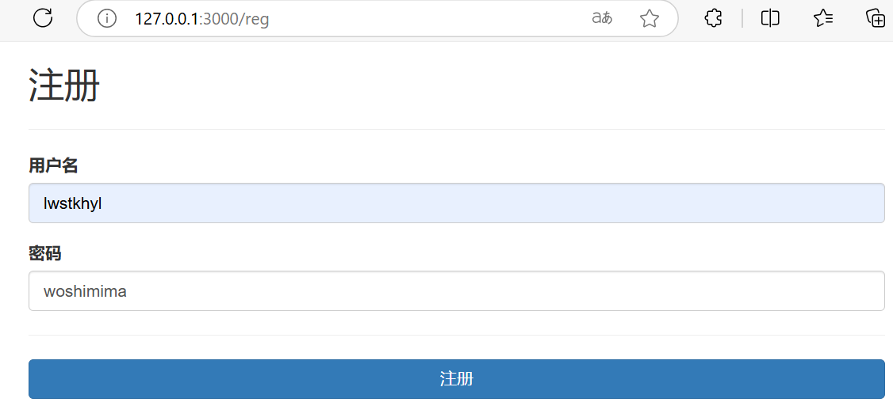{:width=250 height=250}
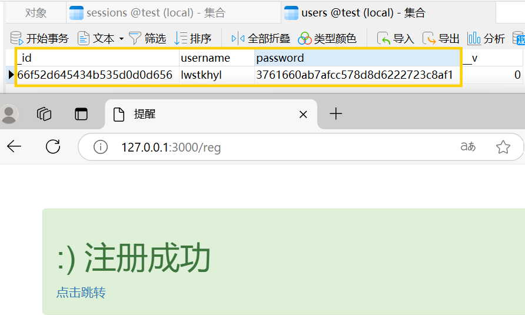{:width=250 height=250}

---

**登录功能**：在`views/auth`中新建`login.ejs`，将“注册”改成“登录”，表单提交路径改成`/login`
```js
/* login.js */
const express = require("express");
const md5 = require("md5");
const router = express.Router();
const UserModel = require("../models/UserModel"); //导入模型
router.get('/', (req, res) => { //渲染注册页面
    res.render("auth/login");
});
router.post('/', (req, res) => { //登录的post请求
    const { username, password } = req.body;
    if (!(username && password)) {
        res.render('error', { msg: "用户名或密码不能为空", url: "/login" });
    }
    UserModel.findOne({ username: username, password: md5(password) }, (err, data) => {
        if (err) {
            res.render('error', { msg: "登录，请稍后再试", url: "/login" });
            return;
        }
        if (!data) {
            res.render('error', { msg: "账号或密码错误", url: "/login" });
            return;
        }
        res.render('success', { msg: "登录成功", url: "/account" });
    });
});
module.exports = router;
```
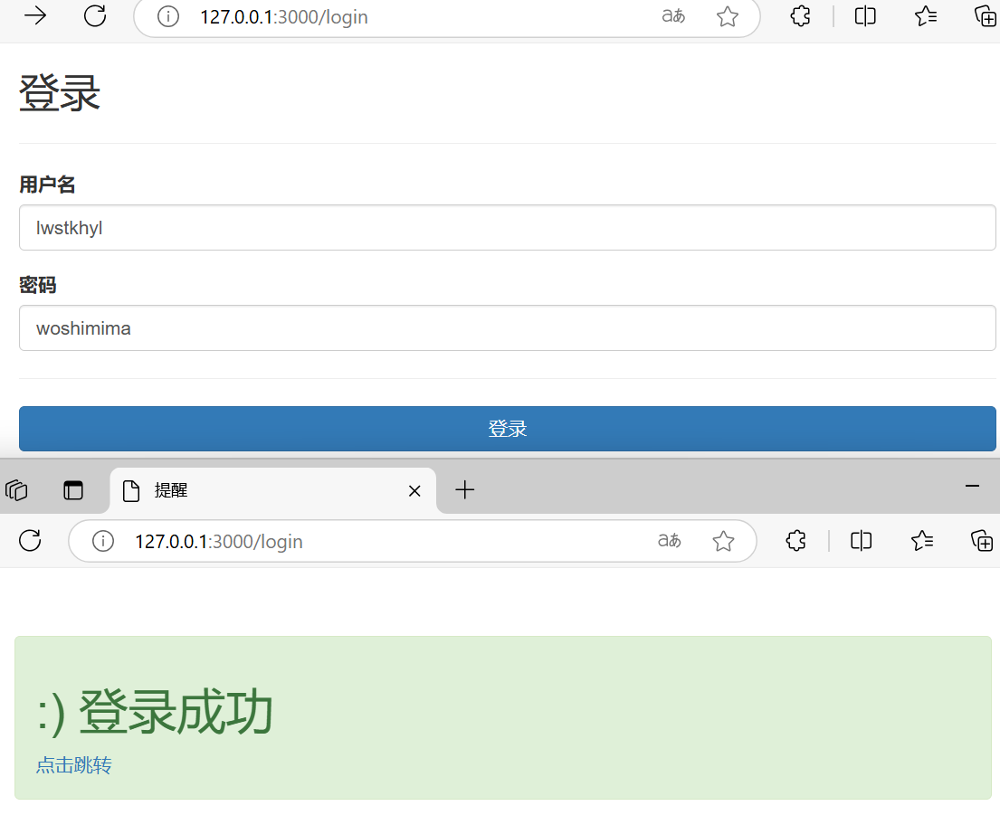{:width=400 height=400}
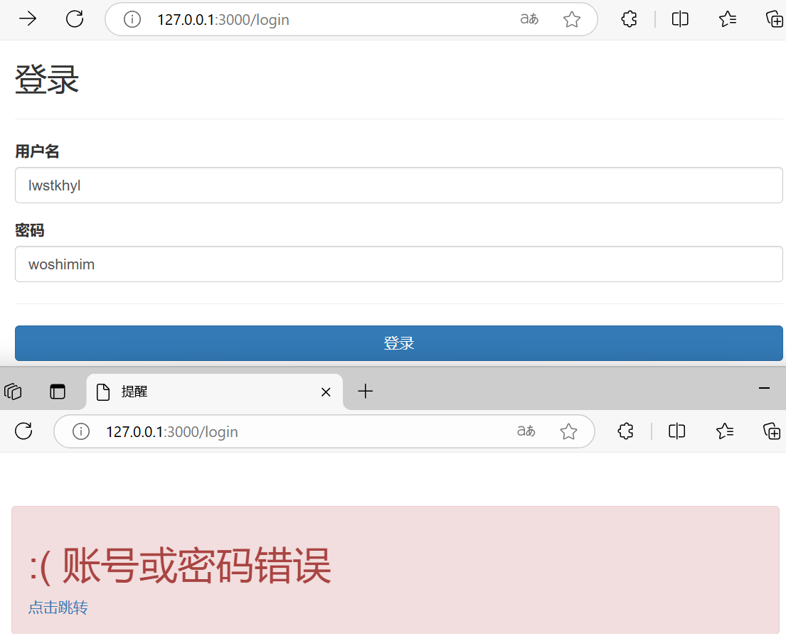{:width=400 height=400}
